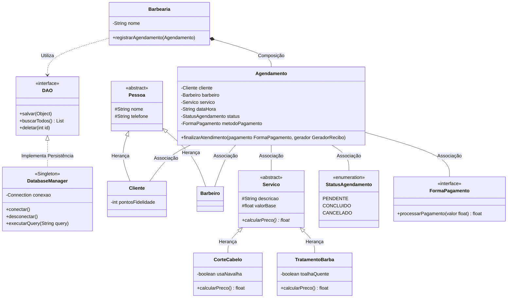

# ✂️ Sistema de Gestão de Barbearia - Desk App III (Com Banco de Dados)

Repositório destinado ao projeto prático de Programação Orientada a Objetos (Engenharia de Software - UnB). O objetivo deste sistema é aplicar os conceitos arquiteturais e pilares da orientação a objetos no desenvolvimento de uma aplicação Desktop utilizando Python, interface gráfica (Tkinter) e persistência de dados.

## 🎥 Apresentação do Projeto

[**Clique aqui para assistir ao vídeo de apresentação e demonstração do sistema no YouTube**](https://youtu.be/vLQ6MQ0niQg)

## O que mudou na Versão III?

A grande atualização desta versão é a implementação de um **Banco de Dados Relacional**. O sistema deixou de usar armazenamento em memória (volátil) e passou a persistir clientes, barbeiros e agendamentos utilizando o padrão arquitetural **DAO (Data Access Object) / Repository**, isolando a regra de negócio do acesso a dados.

## 🏗️ Modelagem do Sistema (Diagrama UML)

O diagrama abaixo ilustra a estrutura de classes, atributos, métodos, relações entre as entidades e a nova camada de persistência.

🧠 Pilares da Orientação a Objetos Aplicados
Este projeto foi estruturado para atender aos 5 requisitos fundamentais, além de introduzir conceitos de persistência:

Herança: Aplicada na abstração de Pessoa e Servico.

Polimorfismo: Implementado através da sobrescrita do método calcular_preco() e nas regras de pagamento.

Composição e Agregação: Relação estrita entre Barbearia e os seus elementos.

Associação: Relações de interação mútua onde o Agendamento conhece as instâncias.

Dependência: A classe Agendamento depende momentaneamente do GeradorRecibo.

Padrões Adicionais: Introdução do padrão DAO (Data Access Object) para isolar as operações de CRUD no banco de dados, mantendo as classes de domínio puras.

🛠️ Tecnologias Utilizadas
Linguagem: Python 3.x

Interface Gráfica: Tkinter (Biblioteca nativa)

Banco de Dados: SQLite

Conector: sqlite3 (Biblioteca nativa do Python, sem necessidade de instalações externas)

Estruturação: MVC (Model-View-Controller) integrado com camada de Persistência (DAO).

🚀 Como Executar o Projeto
Para rodar a aplicação localmente, siga os passos abaixo. Não é necessária a instalação de pacotes via pip, pois o sistema utiliza apenas bibliotecas padrão do Python.

1. Clone o repositório em sua máquina:
 git clone [https://github.com/brunocruvinell/barbearia_desk_app.git](https://github.com/brunocruvinell/barbearia_desk_app.git)

2. Acesse a pasta do projeto:
 cd barbearia_desk_app

3. Execute o arquivo principal:
python main.py

Desenvolvido por Bruno e Gabriel