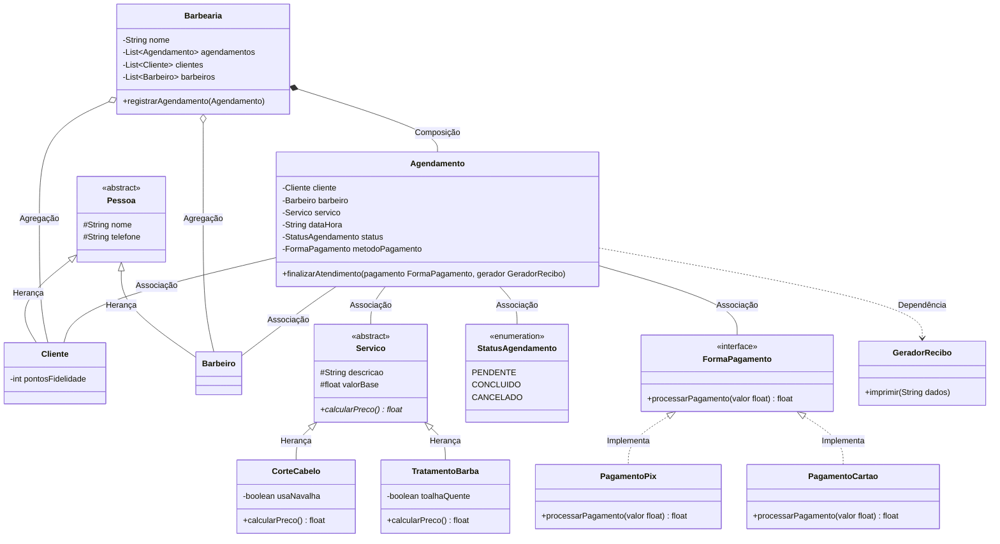

# ✂️ Sistema de Gestão de Barbearia - Desk App II

Repositório destinado ao projeto prático de Programação Orientada a Objetos (Engenharia de Software - UnB). O objetivo deste sistema é aplicar os conceitos arquiteturais e pilares da orientação a objetos no desenvolvimento de uma aplicação Desktop utilizando Python e sua biblioteca nativa de interface gráfica.

## 🎥 Apresentação do Projeto
[**Clique aqui para assistir ao vídeo de apresentação e demonstração do sistema no YouTube**](https://youtu.be/qOcRvk9wGVA?si=aDKSLv4hqbFOO38c)

---

## 🏗️ Modelagem do Sistema (Diagrama UML)

O diagrama abaixo ilustra a estrutura de classes, atributos, métodos e as relações entre as entidades do domínio da barbearia.

🧠 Pilares da Orientação a Objetos Aplicados
Este projeto foi estruturado para atender aos 5 requisitos fundamentais:

Herança: Aplicada na abstração de Pessoa (pai de Cliente e Barbeiro) e Servico (pai de CorteCabelo e TratamentoBarba).

Polimorfismo: Implementado através da sobrescrita (override) do método abstrato calcular_preco() nas classes de serviços específicos.

Composição: Relação estrita entre Barbearia e Agendamento. Se a barbearia deixar de existir, os agendamentos registrados sob ela também deixam.

Associação: Relações de interação mútua onde o Agendamento conhece as instâncias de Cliente, Barbeiro e Servico.

Dependência: A classe Agendamento depende momentaneamente do GeradorRecibo no método finalizar_atendimento() para cumprir sua função, sem guardar um vínculo de estado com ela.

Além dos requisitos básicos, o projeto implementa o padrão de projeto arquitetural Strategy (por meio de interfaces) para o processamento de pagamentos flexíveis e utilização de Enums para controle rigoroso de estado do atendimento.

🛠️ Tecnologias Utilizadas
Linguagem: Python 3.x

Interface Gráfica: Tkinter (Biblioteca nativa, dispensando a instalação de dependências externas)

Estruturação: MVC (Model-View-Controller) simplificado para separar regra de negócio da interface.

🚀 Como Executar o Projeto
Para rodar a aplicação localmente, siga os passos abaixo. Não é necessária a instalação de pacotes via pip, pois o sistema utiliza apenas bibliotecas padrão do Python.

1. Clone o repositório em sua máquina:
 git clone [https://github.com/brunocruvinell/barbearia_desk_app.git](https://github.com/brunocruvinell/barbearia_desk_app.git)

2. Acesse a pasta do projeto:
 cd barbearia_desk_app

3. Execute o arquivo principal:
python main.py

Desenvolvido por Bruno e Gabriel
